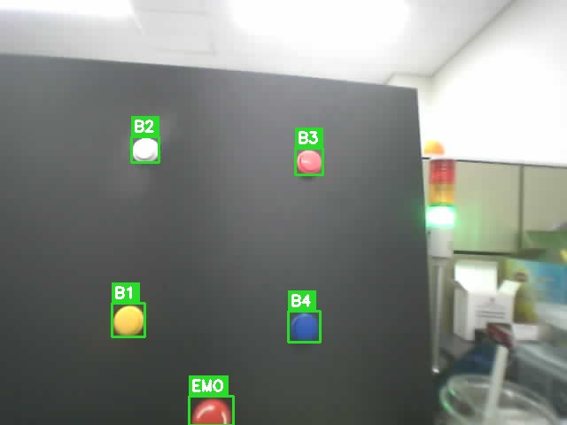
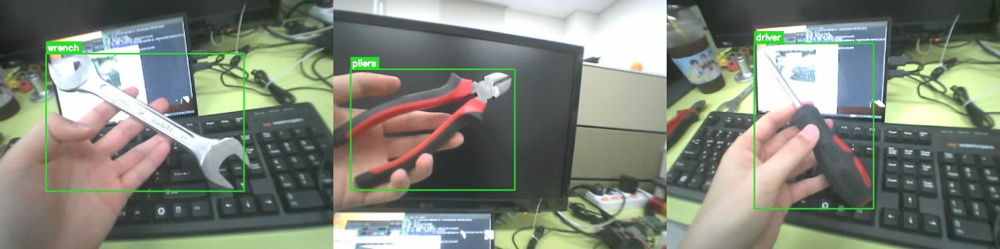
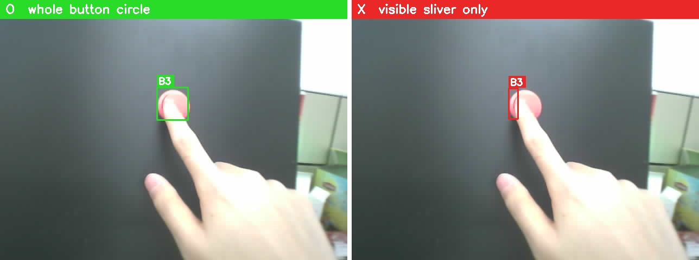
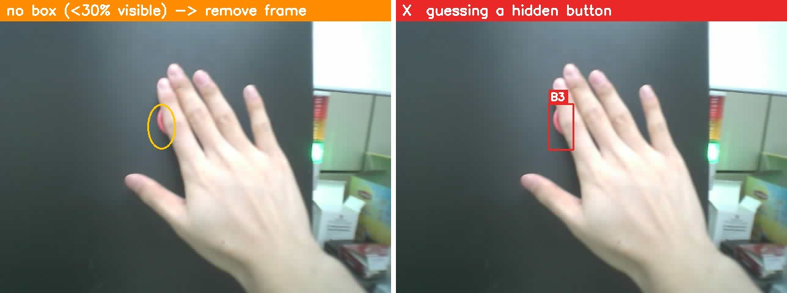
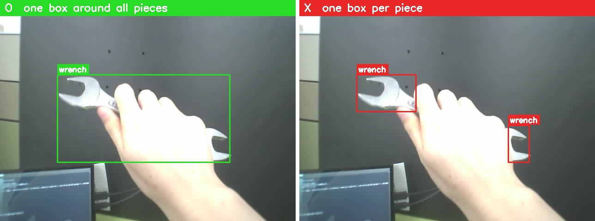
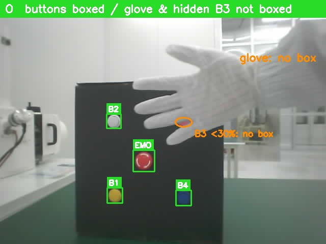

# 라벨링 규칙 — 버튼·공구

> 2026-09-15 · Roboflow **사각형 박스만** 사용 · 배포용 = 같은 내용의 PDF · 이전 판은 git 이력

## 그릴 것 — 8종류

| 버튼 | 생김새 | 자리 | | 공구 | |
|---|---|---|---|---|---|
| **B1** | 노랑 | 왼쪽 아래 | | **driver** | 드라이버 |
| **B2** | 흰색 | 왼쪽 위 | | **wrench** | 렌치(스패너) |
| **B3** | 핑크 | 오른쪽 위 | | **pliers** | 플라이어(펜치) |
| **B4** | 검정 + 파란 동그라미 스티커 | 오른쪽 아래 | | | |
| **EMO** | 빨간 비상정지, **흰 테두리 무늬** | 맨 아래 가운데 | | | |

이 8가지 말고는 그리지 않는다(다른 공구·손·장갑 포함).

## 규칙 5개

**① 반듯한 사각형으로, 물체에 딱 맞게. 물체 하나에 박스 하나.**

**② 버튼이 손가락에 조금 가려져도 → 버튼 동그라미 전체를 그린다.**

**③ 거의 안 보이거나(⅓ 이하) 무엇인지 확신이 없으면 → 그리지 않는다.** 추측해서 그리지 않는다.

**④ 공구를 쥐어 두 조각으로 보여도 → 박스 하나로 두 조각을 모두 감싼다.** 가려진 끝은 늘려 그리지 않는다.

**⑤ 손·장갑 자체에는 박스를 치지 않는다.** 손에 가려진 버튼·공구는 ②~④대로 그린다.

## 헷갈리는 것 두 가지

- **색이 달라 보일 때** — 빛 반사로 노랑이 하얗게 보여도, **그 자리의 버튼 이름**을 쓴다.
- **B3(핑크) ↔ EMO(빨강)** — 다른 버튼과의 **자리**로 구분한다(EMO = 맨 아래 가운데). 버튼 하나만 크게 보이면 **흰 테두리 무늬가 있으면 EMO**. 그래도 모르면 앞뒤 사진을 본다.

## 사진 처리

| 사진 | 처리 |
|---|---|
| 그릴 물체가 있다 | 규칙대로 그린다 |
| **물체가 하나도 없다**(배경·손만) | **박스 0개로 그대로 둔다** — 태그 없음 |
| **확신 못 하는 물체만 보인다** | 박스 없이 **태그 `exclude`** + 코멘트에 이유 한 줄 |

**모르면 그리지 않는다. 틀린 박스는 없는 박스보다 해롭다.**

---

> 예시 사진은 이전 가로 촬영본이다(실제 작업은 세로 화면, 규칙은 같다). 장갑 사진은 이전 모조 콘솔(EMO 가 가운데)이다.
> 근거(검토자용) — sop-project `dev/ai_model/학습이론.md` 2절 · 가림 규칙 조사 4건(2026-09-15) · 비전 모델 재정립 ② 설계.
