<!-- 원본 = Rpi5 Demo/docs/labeling_guide.md(이 파일 하나) · 검토자가 보는 곳 = 아티팩트 페이지 https://claude.ai/artifact/9opbyZ6CTBGGFE3cku1md1 (다시 올리기 = 같은 주소로 publish · url 인자) · 페이지 만들기 = python3 docs/build_guide_page.py docs/labeling_guide.md <출력 html> · 옛 PDF(~/lab/labeling-guide/, 2026-09-16 판)는 쓰지 않는다 · 설계 = sop-project docs/superpowers/specs/2026-09-29-라벨링안내서-design.md -->

# 라벨링 검토 안내서

## 0. 먼저 읽어 주세요

이 안내서는 **라벨링 검토**를 맡은 분이 보는 글입니다. 처음이라면 위에서부터 차례로 읽고 작업하다 막히면 필요한 절만 찾아보세요.

**라벨링 검토란?** 카메라로 찍은 사진에서 버튼과 공구 위치에 네모 박스가 제대로 그려졌는지 확인하고 틀린 박스를 고치는 일입니다. 박스는 대부분 기계(자동 라벨링 프로그램)가 미리 그려 두었습니다. 검토자는 그 박스가 맞는지 보고 틀린 것만 고칩니다.

| 낱말 | 뜻 |
|---|---|
| 묶음 | 사진과 박스 파일을 담은 폴더 하나(예: `b005`). 사진 수는 묶음마다 다르며(b005~b008 200장, b009부터 500장) `안내.txt` 첫 줄에 적혀 있습니다 |
| 박스(라벨) | 사진 속 물체를 감싸는 네모와 그 이름 |
| 기계 | 박스를 미리 그리고 스스로 확인하는 자동 라벨링 프로그램 |
| 초벌 | 기계가 미리 그려 둔 박스 |
| 담당자 | 묶음을 나눠 주고 검토 결과를 받는 사람 |

**전체 흐름**

1. 공유 드라이브에서 맡은 묶음 폴더를 내려받습니다. → 3절
2. 처음 한 번만 프로그램을 설치하고 설정합니다. → 1·2절
3. 사진을 한 장씩 검토합니다. → 4~6절
4. 검토한 `.json` 파일을 공유 드라이브에 올립니다. → 7절
5. 담당자에게 보고합니다. → 7절

> **가장 중요한 원칙은 하나입니다.** 모르면 그리지 않습니다. 틀린 박스는 박스가 없는 것보다 해롭습니다. 헷갈리는 사진은 보고할 때 사진 이름을 적어 주세요.

## 1. 프로그램 설치 (처음 한 번)

X-AnyLabeling이라는 무료 프로그램을 씁니다. 버전은 **v4.0.6** 윈도우용입니다.

1. 구글에서 `x-anylabeling`을 검색해서 GitHub 결과를 누릅니다.

    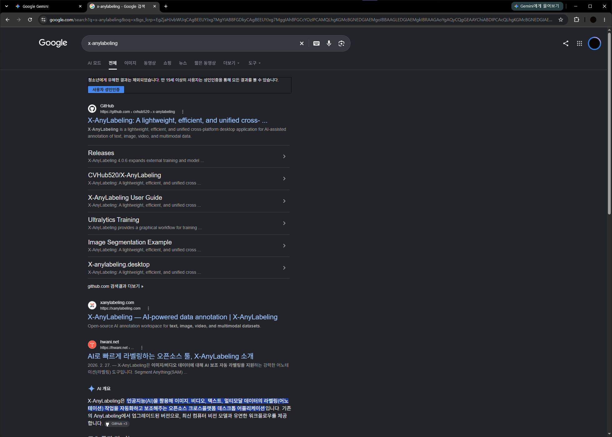

2. 저장소 화면 오른쪽의 **Releases** 아래에 있는 `X-AnyLabeling v4.0.6`을 누릅니다.

    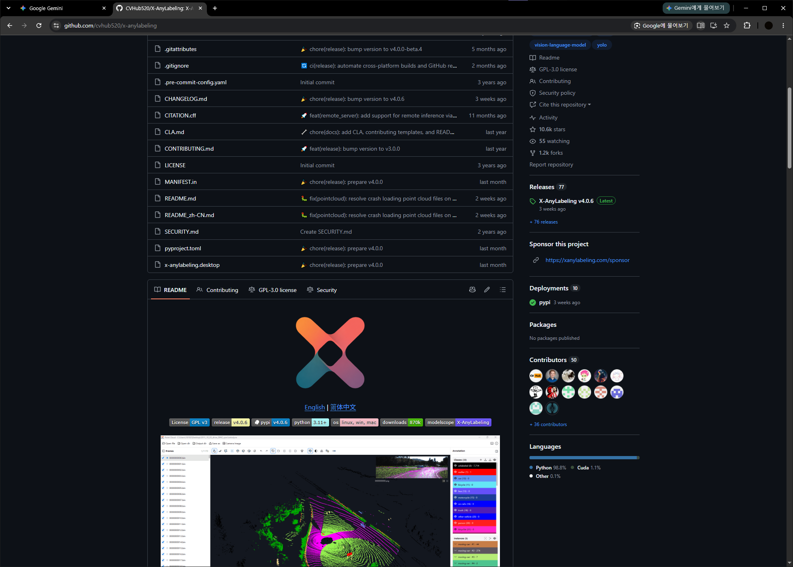

3. 아래로 내려 **Assets**에서 `X-AnyLabeling-v4.0.6-CPU.exe`(약 354MB)를 내려받습니다. 이름에 Linux나 CUDA가 붙은 다른 파일은 받지 않습니다.

    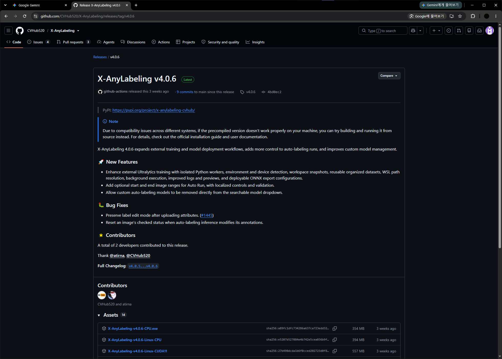

4. 내려받은 파일을 바탕화면처럼 찾기 쉬운 곳에 두고 두 번 누릅니다. 설치 과정 없이 바로 켜집니다.
5. 화면 언어는 위 메뉴의 `Language`(언어)에서 **한국어**로 바꿉니다. 프로그램이 다시 켜집니다. 이 안내서는 한국어 화면을 기준으로 씁니다.
6. 어두운 화면이 편하면 `테마` 메뉴에서 바꿀 수 있습니다(선택).

[X-AnyLabeling v4.0.6 릴리스 화면](https://github.com/CVHub520/X-AnyLabeling/releases/tag/v4.0.6)으로 바로 갈 수도 있습니다.

윈도우가 경고 창을 띄우고 실행을 막으면 담당자에게 물어 주세요.

## 2. 처음 설정 (한 번만)

### 2-1. 「검토함」 칸 보이게 하기

사진을 다 봤다는 표시로 「검토함」 칸을 체크합니다. 이 칸은 처음 설치하면 보이지 않아서 설정 파일에 한 줄을 넣어야 합니다.

1. X-AnyLabeling을 끕니다. 설정 파일이 아직 없다면 프로그램을 한 번 켰다가 끄면 생깁니다.
2. 키보드에서 <kbd>Windows</kbd> + <kbd>R</kbd>을 누르고 실행 창에 `notepad %USERPROFILE%\.xanylabelingrc`를 입력한 뒤 확인을 누릅니다. 메모장에 설정 파일이 열립니다.
3. 메모장에서 <kbd>Ctrl</kbd>+<kbd>F</kbd>로 `flags: null`을 찾습니다. 줄 맨 앞이 `flags:`인 줄입니다. `label_flags:`로 시작하는 줄과 헷갈리지 마세요.
4. 그 한 줄을 지우고 아래 두 줄을 넣습니다. 둘째 줄 앞에는 **빈칸 두 개**를 둡니다.

        flags:
          - 검토함

5. <kbd>Ctrl</kbd>+<kbd>S</kbd>로 저장하고 메모장을 닫습니다.
6. X-AnyLabeling을 다시 켭니다. 오른쪽 `플래그` 칸에 「검토함」 체크 칸이 보이면 됩니다.

### 2-2. 자동 저장 확인

자동 저장은 처음부터 켜져 있습니다. `파일` 메뉴에서 자동 저장에 체크 표시가 있는지만 확인하세요. 자동 저장이 켜져 있으면 박스를 고치거나 「검토함」을 체크하는 순간 저장됩니다. 아무것도 고치지 않은 사진은 저장되지 않습니다. 그래서 사진마다 「검토함」을 체크합니다.

### 2-3. F 키로 박스를 차례로 크게 보기

`Loop Thru Labels` 기능은 <kbd>F</kbd>를 누를 때마다 사진 속 박스를 하나씩 크게 보여 줍니다. 작은 버튼의 끝선을 볼 때 편합니다. v4.0.6에서는 다른 기능이 이미 <kbd>F</kbd>를 쓰고 있어서 두 단계로 바꿉니다.

1. <kbd>Ctrl</kbd>+<kbd>0</kbd>을 눌러 설정 창을 엽니다. 왼쪽 `단축키` → 가운데 `AI`를 고르고 `Finish Object` 칸 오른쪽의 **×**를 눌러 비웁니다. 이 기능은 AI 자동 라벨용이라 이 작업에서는 쓰지 않습니다.

    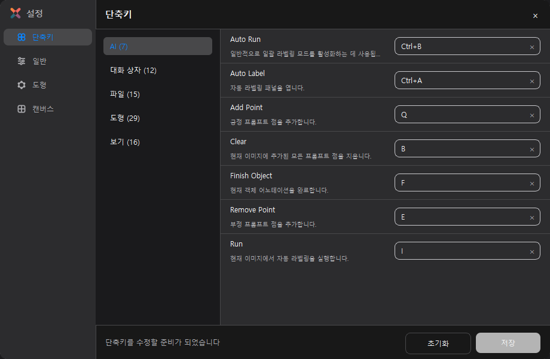

2. 가운데 `도형`을 고르고 `Loop Thru Labels` 칸을 누른 뒤 <kbd>F</kbd>를 누릅니다. 오른쪽 아래 `저장`을 누릅니다.

    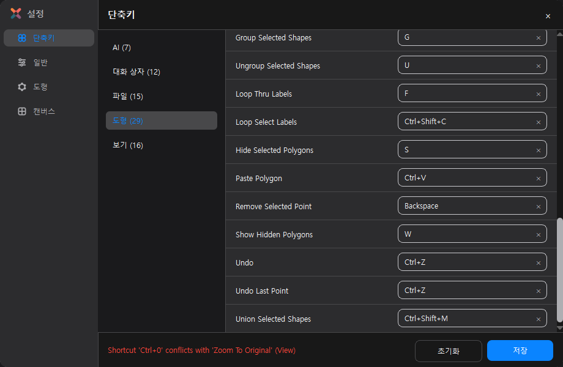

- 창 아래에 빨간 글씨로 「Shortcut 'Ctrl+0' conflicts with 'Zoom To Original'」이 보여도 괜찮습니다. 원래 있던 알림이라 저장에는 문제가 없습니다.
- 잘못 바꿨으면 `초기화`를 누르면 처음 상태로 돌아갑니다.

### 2-4. 자주 쓰는 단축키

| 키 | 하는 일 |
|---|---|
| <kbd>A</kbd> | 이전 사진 |
| <kbd>D</kbd> | 다음 사진 |
| <kbd>R</kbd> | 사각형 박스 그리기 |
| <kbd>Delete</kbd> | 고른 박스 지우기 |
| <kbd>Ctrl</kbd>+<kbd>Z</kbd> | 방금 한 일 되돌리기 |
| <kbd>Ctrl</kbd>+<kbd>E</kbd> | 고른 박스의 이름 고치기 |
| <kbd>F</kbd> | 박스 차례로 크게 보기(2-3 설정 뒤) |
| <kbd>Ctrl</kbd>+<kbd>F</kbd> | 사진을 화면 크기에 맞추기 |
| <kbd>Ctrl</kbd>+<kbd>+</kbd>, <kbd>Ctrl</kbd>+<kbd>-</kbd> | 확대·축소 |
| <kbd>Ctrl</kbd>+<kbd>0</kbd> | 설정 창 |

화면 위쪽 줄에도 기본 단축키가 적혀 있습니다(이전 A, 다음 D, 직사각형 R, 설정 Ctrl+0).

## 3. 묶음 받기와 열기

1. 공유 드라이브에서 맡은 묶음 폴더(예: `b005`)를 통째로 내려받습니다. 압축 파일(zip)로 내려오면 압축을 풉니다.
2. 폴더 안의 `images` 폴더에 사진과 같은 이름의 `.json` 파일이 같은 수만큼 들어 있습니다(500장 묶음이면 `.json`도 500개). `.json` 파일이 박스를 담은 파일입니다. 폴더 안의 다른 파일(`안내.txt`, `classes.txt`, `manifest.json` 등)은 건드리지 않습니다.
3. X-AnyLabeling에서 <kbd>Ctrl</kbd>+<kbd>U</kbd>(폴더 열기)를 누르고 `images` 폴더를 고릅니다.

**화면 보는 법**

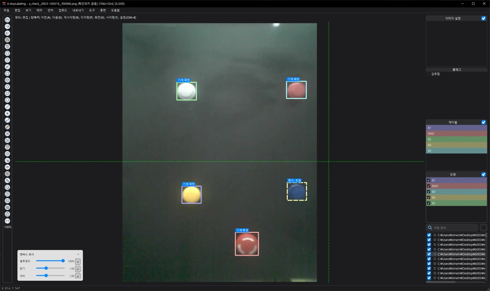

| 자리 | 무엇 |
|---|---|
| 가운데 | 사진과 박스. 박스 위 작은 글자가 박스 설명입니다(4절). |
| 맨 위 제목 줄 | 사진 이름, 사진 크기, 몇 번째 사진인지(예: `[5/200]`). `[확인되지 않음]`은 프로그램 자체 표시라 신경 쓰지 않아도 됩니다. |
| 오른쪽 `플래그` | 「검토함」 체크 칸 |
| 오른쪽 `레이블` | 이 묶음에 나온 이름 목록 |
| 오른쪽 `도형` | 이 사진의 박스 목록. 누르면 그 박스가 골라집니다. |
| 오른쪽 아래 | 파일 목록 |

## 4. 박스 읽는 법

### 4-1. 박스 위 글자

| 박스 위 글자 | 뜻 | 할 일 |
|---|---|---|
| `기계 확정` (실선) | 기계가 여러 방법으로 확인해 맞다고 본 버튼 박스 | 훑어보기만 합니다. 이름이 틀렸거나 버튼이 아니면 고칩니다. |
| `확인: 이유` (점선) | 기계가 확신하지 못한 버튼 박스 | 꼼꼼히 봅니다. 이름, 박스 위치, 진짜 버튼인지 |
| `공구 초벌 — 확인` | 기계가 그린 공구 박스 | 모두 꼼꼼히 봅니다. 공구는 항상 사람이 확인합니다. |
| `제안_B3` 같은 이름 | 옛 묶음에만 있는 빠진 자리 제안 | 맞으면 이름을 `B3`처럼 고치고 아니면 지웁니다. 새 묶음에는 나오지 않습니다. |

### 4-2. 확인 이유 10가지

| 이유 | 뜻 | 볼 것 |
|---|---|---|
| 버튼 1개 | 버튼이 하나만 보여 다른 버튼과 자리를 견줄 수 없음 | 이름이 맞는지(색, EMO 흰 테두리 무늬) |
| 배치 불확실 | 버튼들의 자리가 판의 원래 배치와 잘 맞지 않음(카메라가 움직이거나 비스듬할 때) | 이름과 박스 |
| 배치상 버튼 아님 | 자리로 보면 버튼이 없는 곳 | 진짜 버튼인지. 손, 장갑, 빛 반사라면 지웁니다. |
| 배치≠초벌 | 자리로 본 이름과 박스 이름이 다름 | 이름(특히 `B3`와 `EMO`) |
| 박스 맞추기 실패 | 박스를 버튼 테두리에 딱 맞추지 못함 | 박스 네 변. 느슨하면 버튼에 맞춥니다. |
| 가림·모양 이상 | 버튼이 가려졌거나 모양이 동그랗지 않음 | 6절 규칙 ②와 ③ |
| 크기 이상 | 다른 버튼보다 박스가 너무 크거나 작음 | 박스 크기와 진짜 버튼인지 |
| 색≠초벌 | 박스 안 색이 그 이름의 버튼 색과 다름 | 이름. 빛 반사로 색이 달라 보일 수 있습니다. |
| 무늬≠초벌 | EMO의 흰 테두리 무늬가 이름과 맞지 않음 | `B3`인지 `EMO`인지 |
| 흐림 | 흔들려서 흐린 사진 | 알아볼 수 있으면 평소처럼, 아니면 6절 규칙 ③ |

### 4-3. 파일 이름 앞머리 = 검토 순서

파일 목록은 아래 순서로 놓여 있습니다. 위에서부터 차례로 보면 됩니다.

| 앞머리 | 어떤 사진 | 볼 정도 |
|---|---|---|
| `a_check` | 확인 박스(점선)나 공구 초벌이 있는 사진 | 가장 꼼꼼히 |
| `b_propose` | 빠진 자리 제안이 있는 사진(옛 묶음) | 제안을 정리 |
| `c_auto` | 기계 확정 박스만 있는 사진 | 훑어보고 빠진 물체만 확인 |
| `d_blur` | 흐림 후보 | 평소처럼. 지울 사진이라는 뜻이 아닙니다. |

## 5. 검토 방법

### 5-1. 사진 한 장 검토 순서

1. 박스 위 글자를 봅니다. 확인 박스와 공구 초벌 박스부터 봅니다.
2. 틀린 박스를 고칩니다(5-2).
3. 사진 전체를 훑어 빠진 버튼이나 공구가 없는지 봅니다. 책상 위나 배경에 보이는 공구도 그립니다.
4. 오른쪽 `플래그`의 「검토함」을 체크합니다. 이 순간 저장됩니다.
5. <kbd>D</kbd>로 다음 사진으로 넘어갑니다.

### 5-2. 고치는 법

| 하고 싶은 것 | 방법 |
|---|---|
| 박스 옮기기 | 박스 안을 눌러 끌어 옮깁니다. |
| 크기 바꾸기 | 박스 모서리나 변의 점을 끕니다. |
| 이름 바꾸기 | 박스를 고르고 <kbd>Ctrl</kbd>+<kbd>E</kbd> → 이름을 고르거나 입력 → `OK` |
| 박스 지우기 | 박스를 고르고 <kbd>Delete</kbd> |
| 새로 그리기 | <kbd>R</kbd> → 사진 위에서 끌어 박스를 그림 → 이름 창에서 이름을 고르고 `OK` |
| 되돌리기 | <kbd>Ctrl</kbd>+<kbd>Z</kbd> |

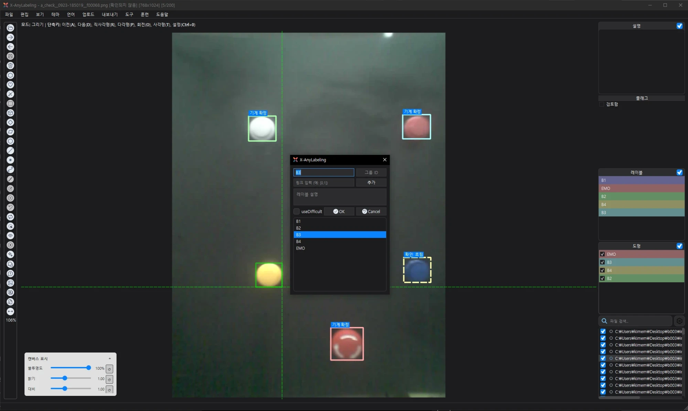

- 이름 창 목록에는 **그 묶음에 이미 나온 이름만** 보입니다. 목록에 없으면 위 칸에 정확히 입력합니다.
  - 버튼은 `B1` `B2` `B3` `B4` `EMO`(대문자)
  - 공구와 제외는 `driver` `wrench` `pliers` `exclude`(소문자)
- 이름을 틀리게 쓰면(예: `B5`) 담당자가 결과를 받을 때 걸러져서 다시 작업해야 합니다.
- 이름 창의 다른 칸(그룹 ID, 링크, 레이블 설명, useDifficult)은 건드리지 않습니다.

### 5-3. 고치지 않는 것

- 🔴 `기계 확정` 박스의 **아래 끝선**이 버튼 끝보다 조금 위에 있어도 그대로 둡니다.
- 🔴 `B4` 박스의 **위 끝선**이 버튼보다 조금 넘쳐도 그대로 둡니다.
- 기계가 늘 같은 쪽으로 조금씩 치우치게 그리는 것이라서 사람마다 다르게 고치면 오히려 기준이 흔들립니다. **새로 그리는 박스만** 6절 규칙 ①대로 딱 맞게 그립니다.
- 왼쪽 도구 막대의 AI 자동 라벨 기능은 쓰지 않습니다.

### 5-4. 알아볼 수 없는 사진, 물체가 없는 사진

- **흐리거나 번져서 물체를 알아볼 수 없는 사진**은 <kbd>R</kbd>로 사진 위 아무 곳에 박스를 하나 그리고 이름을 `exclude`로 합니다. 다른 박스는 그대로 두어도 됩니다. 그리고 「검토함」을 체크합니다.
- **물체가 하나도 없는 사진**(배경이나 손만 보임)은 박스 없이 「검토함」만 체크합니다.

## 6. 라벨 규칙

> **그림 보는 법.** 초록 테두리는 맞음, 빨간 테두리와 X는 틀림, 주황 테두리는 그리지 않는 게 맞음을 뜻합니다.

### 6-1. 그릴 것 8가지

| 버튼 | 생김새 | 자리 |
|---|---|---|
| `B1` | 노랑 | 왼쪽 아래 |
| `B2` | 흰색 | 왼쪽 위 |
| `B3` | 핑크 | 오른쪽 위 |
| `B4` | 검정 버튼 윗면 전체에 파란 테이프를 모양대로 붙여서 파랗게 보임 | 오른쪽 아래 |
| `EMO` | 빨간 비상정지 버튼, **흰 테두리 무늬**가 있음 | 맨 아래 가운데 |

| 공구 | 이름 |
|---|---|
| `driver` | 드라이버 |
| `wrench` | 렌치(스패너) |
| `pliers` | 플라이어(펜치) |

렌치는 모양이 다른 두 개가 있지만 **둘 다 `wrench` 하나로** 그립니다. 그래서 한 사진에 `wrench` 박스가 2개일 수 있습니다. `driver` 와 `pliers` 는 하나씩뿐이라, 같은 이름의 박스가 2개 나오면 한 공구에 박스가 겹친 것입니다.

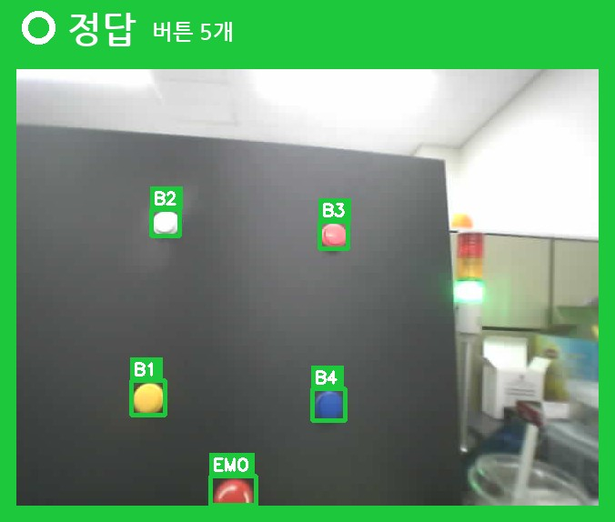

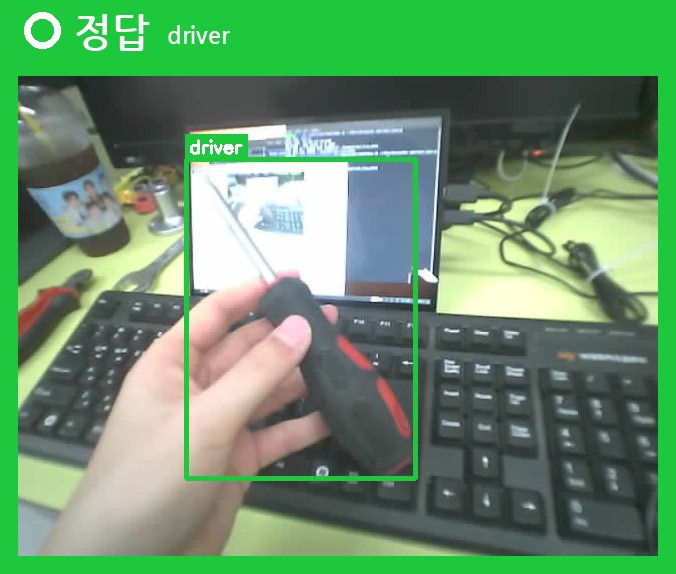 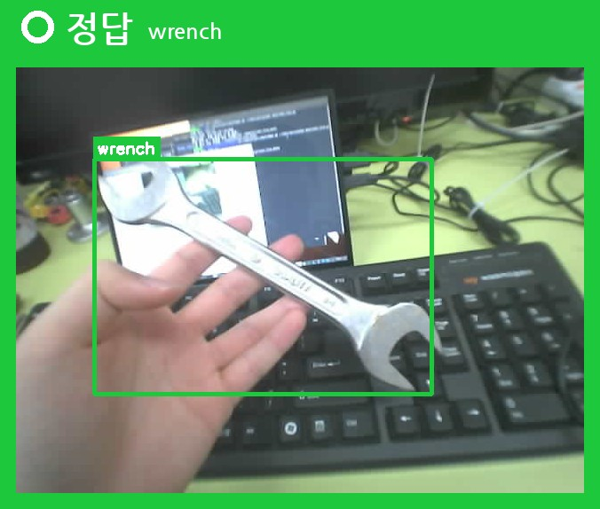 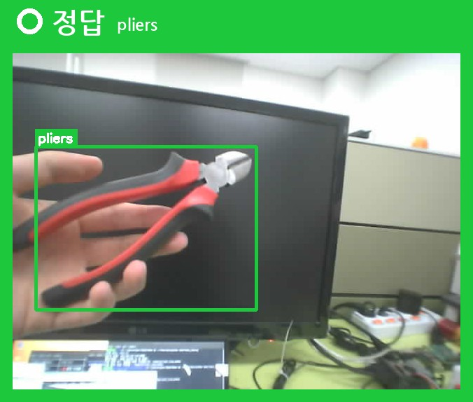

이 8가지 말고는 그리지 않습니다. 다른 공구, 손, 장갑도 그리지 않습니다. 8가지는 손에 든 것뿐 아니라 **책상 위나 배경에 보이는 것도 모두** 그립니다.

### 6-2. 규칙 5가지

**① 반듯한 사각형으로, 물체에 딱 맞게 그립니다. 물체 하나에 박스 하나입니다.**

- 여백을 두지 않습니다. 네 변을 물체의 가장 바깥에 보이는 부분에 붙입니다. 박스와 물체 사이로 판이 보이면 틀린 박스입니다.
- 버튼의 그늘진 테두리는 넣고 버튼 둘레의 빛 번짐, 그림자, 반사는 뺍니다.
- 흔들려서 가장자리가 번졌으면 번진 띠 가운데 버튼 색이 판 색보다 짙은 곳까지만 넣고 희미한 꼬리는 뺍니다. 끝선은 크게 확대(200~400%)해서 확인합니다.

**② 버튼이 손가락에 조금 가려져도 버튼 동그라미 전체를 그립니다.** 보이는 테두리가 이어지는 모양 전체를 감쌉니다. 비스듬히 보이면 타원 모양 전체를 감쌉니다.

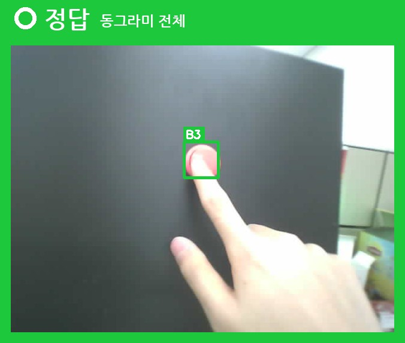 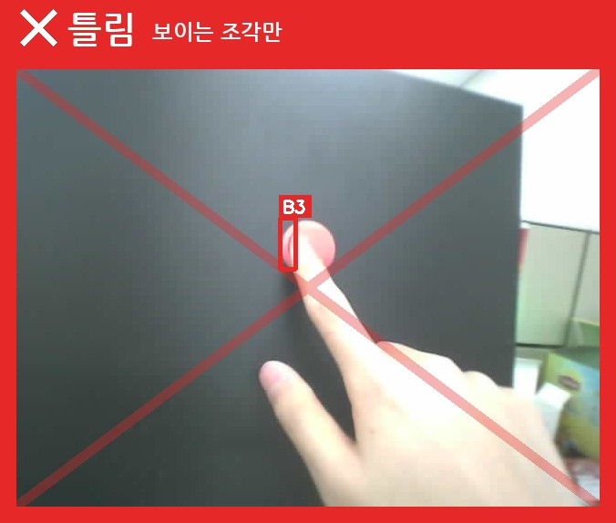

**③ 거의 안 보이거나(3분의 1 이하) 무엇인지 확신이 없으면 그리지 않습니다.** 짐작해서 그리지 않습니다. 흔들림 잔상으로 물체가 두 개로 겹쳐 보이거나 번져서 알아볼 수 없을 때도 그리지 않습니다.

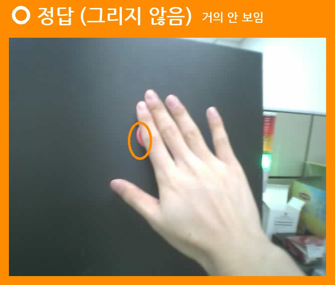 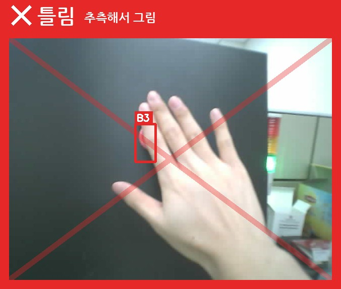

**④ 공구를 쥐어서 두 조각으로 보여도 박스 하나로 두 조각을 모두 감쌉니다.** 가려진 끝을 늘려 그리지 않습니다. 손잡이나 머리처럼 **한 부분만 보이면 보이는 그 부분만** 그립니다. 거의 안 보이거나 무엇인지 확신이 없으면 ③대로 그리지 않습니다.

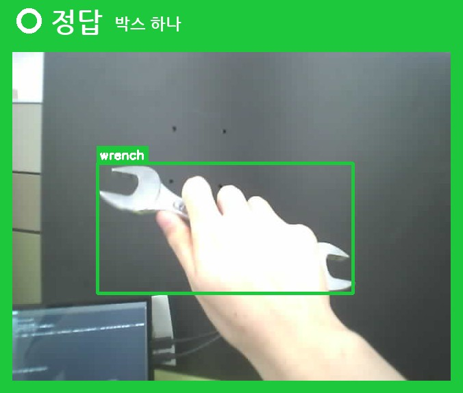 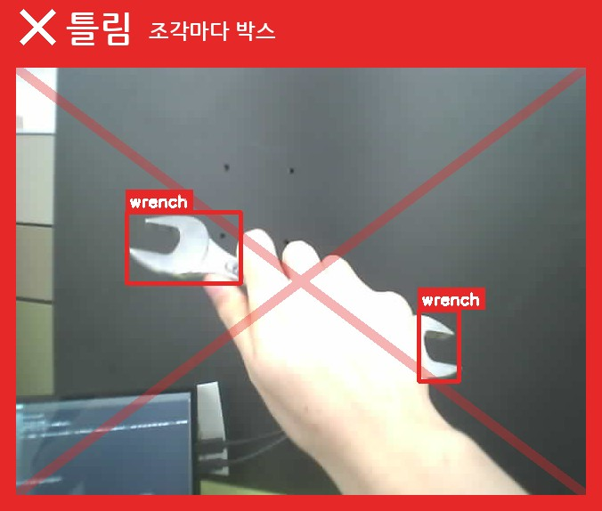

**⑤ 손이나 장갑에는 박스를 그리지 않습니다.** 손에 가려진 버튼, 공구는 ②~④대로 그립니다.

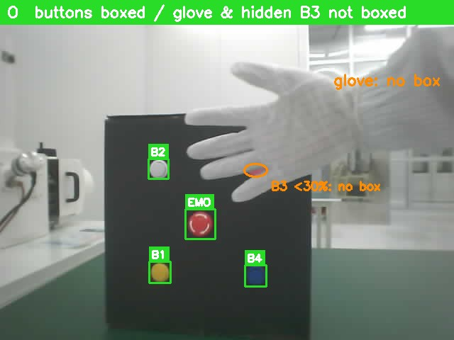

### 6-3. 헷갈리는 것 2가지

- **색이 달라 보일 때.** 빛 반사로 노란 버튼이 하얗게 보여도 그 자리에 있는 버튼의 이름을 씁니다.
- **`B3`(핑크)와 `EMO`(빨강).** 다른 버튼과의 자리로 구분합니다(`EMO`는 맨 아래 가운데). 버튼 하나만 크게 보일 때는 흰 테두리 무늬가 있으면 `EMO`입니다. 그래도 모르겠으면 앞뒤 사진을 봅니다.

### 6-4. 사진 처리

| 사진 | 처리 |
|---|---|
| 그릴 물체가 있다 | 규칙대로 그리고 「검토함」 체크 |
| 물체가 하나도 없다(배경, 손만) | 박스 없이 「검토함」 체크 |
| 확신할 수 없는 물체만 보인다(잔상, 번짐 포함) | <kbd>R</kbd>로 사진 위에 박스 하나를 그리고 이름을 `exclude`로 → 「검토함」 체크. 다른 박스는 남겨도 지워도 됩니다. |

예시 그림은 예전에 가로로 찍은 사진입니다. 지금 작업하는 사진은 세로이지만 규칙은 같습니다. 장갑 그림은 예전 모형 콘솔(`EMO`가 가운데)입니다.

## 7. 올리기와 보고

1. 파일 탐색기로 묶음의 `images` 폴더를 엽니다.
2. 오른쪽 위 검색 칸에 `*.json`을 입력하면 `.json` 파일만 보입니다. <kbd>Ctrl</kbd>+<kbd>A</kbd>로 모두 고른 뒤 아래에 묶음 사진 수와 같은 「N개 항목 선택함」(500장 묶음이면 「500개 항목 선택함」)이 보이는지 확인합니다.
3. 공유 드라이브의 같은 묶음 폴더 안에 있는 `returned` 폴더로 끌어다 놓습니다. `returned` 폴더가 없으면 이 이름으로 새로 만듭니다.
4. 사진 파일(`.png`)은 올리지 않습니다. 담당자에게 원본이 있습니다.
5. 담당자에게 아래처럼 보고합니다.

```
묶음: b005
검토자: A
다 봤나요: 예 (모두 검토함 체크)
exclude 한 사진: 3장
헷갈린 사진: a_check__0923-185019__f00068 (B3인지 EMO인지)
```

사진은 위 예처럼 **시각까지 붙인 전체 이름**으로 적습니다. 끝의 번호(`f00068`)는 촬영할 때마다 0번부터 다시 세서, 번호만 쓰면 다른 사진과 겹칩니다.

## 8. 막히면

| 이런 일이 생기면 | 이렇게 합니다 |
|---|---|
| 「검토함」 칸이 없다 | 2-1을 다시 합니다. |
| 메모장에서 설정 파일이 없다고 한다 | X-AnyLabeling을 한 번 켰다 끈 뒤 2-1을 다시 합니다. |
| <kbd>F</kbd>를 눌러도 박스 확대가 안 된다 | 2-3을 다시 합니다. `Finish Object` 칸이 비어 있는지 봅니다. |
| 저장이 안 된 것 같다 | 박스를 고치거나 「검토함」을 체크해야 저장됩니다. `파일` 메뉴의 자동 저장을 확인하고 필요하면 <kbd>Ctrl</kbd>+<kbd>S</kbd>를 누릅니다. |
| 박스를 잘못 지웠다 | <kbd>Ctrl</kbd>+<kbd>Z</kbd> |
| 이름을 잘못 입력했다 | 박스를 고르고 <kbd>Ctrl</kbd>+<kbd>E</kbd>로 고칩니다. |
| 무엇인지 모르겠다 | 그리지 않고 보고할 때 사진 이름을 적습니다. |

---

## 규칙을 이렇게 정한 까닭(참고)

- **① 여백 없이 붙이기.** 공개 데이터셋 지침(VOC, ImageNet, Open Images), Ultralytics, AWS가 모두 「보이는 가장 바깥 픽셀에 붙인다」고 합니다. 손끝 판정의 여유는 라벨이 아니라 시연 프로그램에서 따로 줍니다. 번진 가장자리 규칙은 VOC의 「섞인 픽셀은 색이 더 많이 섞인 쪽」을 박스에 옮긴 것입니다.
- **② 동그라미 전체.** 보통 데이터셋은 보이는 부분만 그리지만, 버튼은 크기와 모양이 정해진 단단한 물체이고 누르는 동안 박스가 흔들리지 않게 하려고 전체를 그립니다. 테두리로 모양을 정할 수 없으면 ③대로 그리지 않습니다.
- **기계 박스의 끝선 치우침을 고치지 않는 까닭.** 치우침이 박스마다 제각각이라 한 값으로 맞출 수 없고, 사람마다 다르게 고치면 기준이 흔들리기 때문입니다(담당자 결정).

<!-- 근거 자료(관리자용) — sop-project dev/ai_model/학습이론.md 2절 · 가림 규칙 조사 4건(2026-09-15) · dev/ai_model/조사/reports/박스 여백 라벨링 기준 조사.md · 반자동라벨링 설계 §6 ① · 라벨링 안내서 설계 2026-09-29 -->
